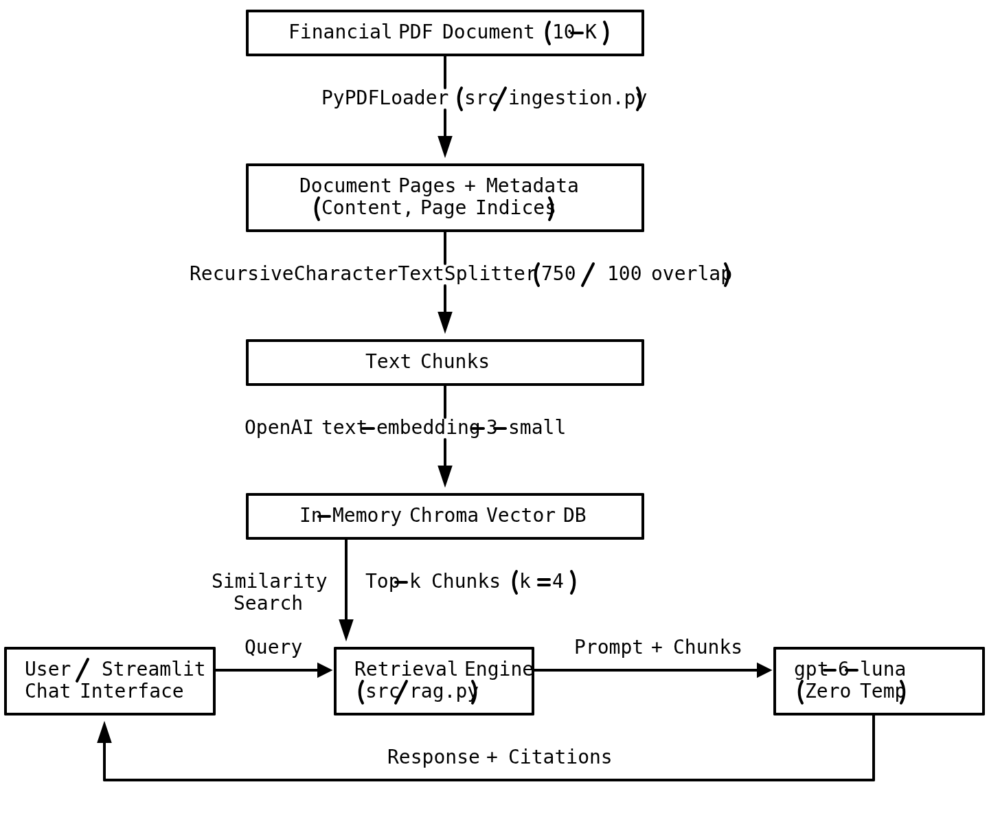

### Financial Report RAG Analyst
A production-grade Retrieval-Augmented Generation (RAG) MVP designed to ingest complex financial disclosures (such as SEC Form 10-K filings) and deliver grounded, factual analysis with page-level citations.

### Architecture Overview


### Features
- Grounded Financial Analysis: Enforces zero temperature (temperature=0.0) and strict system prompt constraints to eliminate hallucinations.
- Traceable Page Citations: Extracts and computes 1-indexed document page numbers, providing interactive citation drawers for auditability.
- Clean Ingestion Pipeline: Uses RecursiveCharacterTextSplitter with dynamic chunking suitable for narrative sections and tables.
- State & Storage Management: In-memory ChromaDB vector store with one-click full application reset and collection teardown.
- Modular Codebase: Clean separation between presentation logic (app.py), document parsing (src/ingestion.py), and retrieval/synthesis (src/rag.py).

###Tech Stack
- Runtime & Package Management: uv (Astral)
- Application Framework: Streamlit
- LLM & Embeddings: OpenAI (gpt-4o-mini, text-embedding-3-small)
- Orchestration: LangChain Core / Community
- Vector Storage: ChromaDB (In-memory)
- PDF Extraction: PyPDF

### Getting Started
Prerequisites
Ensure uv is installed on your system. If not, install it via the official installer:

```
# macOS / Linux
curl -LsSf https://astral.sh/uv/install.sh | sh

# Windows (PowerShell)
powershell -c "irm https://astral.sh/uv/install.ps1 | iex"
```

### 1. Clone the Repository

```
git clone <your-repo-url>
cd financial-rag
```

### 2. Install Dependencies
Sync the environment and install all locked dependencies using uv:
```
uv sync
```
Alternatively, if setting up from scratch:
```
uv add streamlit langchain langchain-openai langchain-community pypdf chromadb tiktoken
```

### 3. Run the Application
Launch the Streamlit app directly inside the isolated virtual environment:
```
uv run streamlit run app.py
```
Open http://localhost:8501 in your browser.

### Usage
1. API Key Setup: Enter your OpenAI API Key into the sidebar input (sk-...). The key remains isolated to your current browser session.
2. Ingest Report: Upload an annual or quarterly report in PDF format (e.g., Apple 2023 Form 10-K).
3. Query: Ask targeted questions in the chat box:
    - "What were the primary drivers of revenue growth this fiscal year?"
    - "What are the most significant supply chain risks listed?"
    - "What was the total research and development expenditure?"
4. Inspect Citations: Expand the View Retrieved Sources & Citations panel under any assistant response to review the exact raw context chunks and source pages used.
5. Reset: Use the Reset All button in the sidebar to delete the active Chroma collection and reset session state for a new document.
